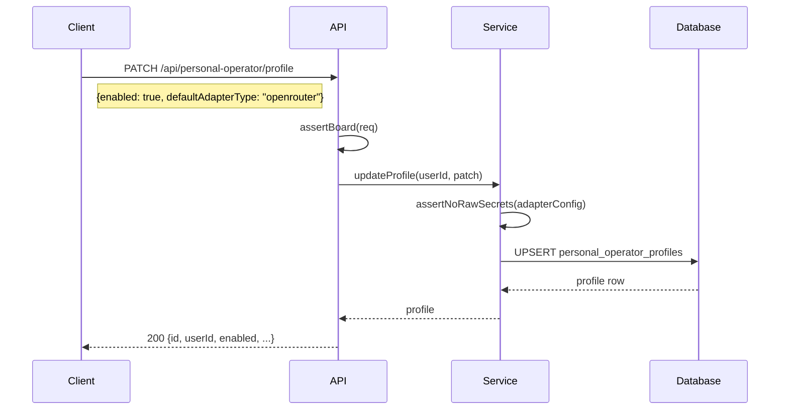

# API

All application routes are mounted under `/api`. The server is an Express app that validates requests with Zod schemas from `@paperclipai/shared` and persists data through `@paperclipai/db`.

## Authentication

| Actor | Method | Scope |
|---|---|---|
| Board operator | Session cookie or local trusted mode | Full control |
| Agent | `Authorization: Bearer <agent_api_key>` | Company-scoped |
| Daemon | `Authorization: Bearer <daemon_token>` | Loopback session only |

## Existing API Areas

| Method | Path Pattern | Auth | Description |
|---|---|---|---|
| `GET` | `/api/health` | None | Server health check |
| `*` | `/api/companies/*` | Board | Company CRUD, branding, export/import, org hierarchy |
| `*` | `/api/agents/*` | Board/Agent | Agent management, config, instructions, skills |
| `*` | `/api/issues/*` | Board/Agent | Issue lifecycle, comments, attachments, work products |
| `*` | `/api/projects/*` | Board | Projects, workspaces, goals |
| `*` | `/api/routines/*` | Board | Scheduled routines, triggers, runs |
| `*` | `/api/goals/*` | Board | Company and project goals |
| `*` | `/api/approvals/*` | Board | Approval gates, voting, comments |
| `*` | `/api/secrets/*` | Board | Company secrets management |
| `*` | `/api/costs/*` | Board | Cost events, spend tracking |
| `*` | `/api/activity/*` | Board | Activity log queries |
| `*` | `/api/plugins/*` | Board | Plugin lifecycle, config, jobs, examples |
| `*` | `/api/access/*` | Board | Memberships, invites, permissions |
| `*` | `/api/instance-settings/*` | Board | Global instance configuration |
| `*` | `/api/sidebar-badges/*` | Board | Sidebar badge counts |
| `*` | `/api/llms/*` | Board | LLM model listing |

Company-scoped endpoints must enforce company access checks.

## Personal AI Operator Endpoints

### Profile

| Method | Path | Description |
|---|---|---|
| `GET` | `/api/personal-operator/profile` | Get current profile (returns defaults if none exists) |
| `PATCH` | `/api/personal-operator/profile` | Update profile flags and adapter config |



**Request body** (`PATCH`):
```json
{
  "enabled": true,
  "defaultAdapterType": "openrouter",
  "defaultAdapterConfig": {
    "apiKey": {"type": "secret_ref", "secretId": "uuid", "version": "latest"}
  },
  "daemonEnabled": false,
  "browserControlEnabled": false,
  "desktopControlEnabled": false,
  "screenshotVisionEnabled": true
}
```

### Permissions

| Method | Path | Description |
|---|---|---|
| `GET` | `/api/personal-operator/permissions` | List all company permissions for current user |
| `PUT` | `/api/personal-operator/permissions/:companyId` | Upsert permission flags for a company |

**Request body** (`PUT`):
```json
{
  "readEnabled": true,
  "writeEnabled": true,
  "browserControlEnabled": false,
  "desktopControlEnabled": false,
  "approvalRequired": true
}
```

Permission updates emit an activity log entry with `personal_operator.permission_updated`.

### Sessions and Daemon

| Method | Path | Description |
|---|---|---|
| `POST` | `/api/personal-operator/sessions` | Create a new daemon session |
| `POST` | `/api/personal-operator/sessions/:sessionId/daemon-token` | Mint a short-lived daemon bearer token |
| `GET` | `/api/personal-operator/daemon/health?baseUrl=...` | Proxy daemon health check |

**Session creation**:
```json
{
  "daemonBaseUrl": "http://127.0.0.1:3177"
}
```

The `daemonBaseUrl` must be a loopback address. External URLs are rejected with `403`.

**Daemon token response**:
```json
{
  "token": "pco_<base64url>",
  "expiresAt": "2025-01-01T00:05:00.000Z"
}
```

The raw token is returned **only at issuance time**. A SHA-256 hash is stored server-side.

### Runs and Audit

| Method | Path | Description |
|---|---|---|
| `GET` | `/api/personal-operator/runs` | List recent runs (most recent 50) |
| `POST` | `/api/personal-operator/runs` | Create a new run |
| `POST` | `/api/personal-operator/runs/:runId/actions` | Record an action for a run |
| `POST` | `/api/personal-operator/runs/:runId/screenshots` | Record screenshot metadata |

**Run creation**:
```json
{
  "companyId": "uuid",
  "prompt": "Triage inbox issues for this company",
  "adapterType": "openrouter",
  "adapterConfig": {
    "apiKey": {"type": "secret_ref", "secretId": "uuid", "version": "latest"}
  }
}
```

Requires: profile enabled, company allowlisted (if `companyId` provided).

**Action recording**:
```json
{
  "companyId": "uuid",
  "kind": "navigate",
  "method": "browser_dom",
  "target": "https://example.com",
  "payload": {"selector": "#submit-btn"},
  "result": {"clicked": true},
  "status": "succeeded",
  "requiresApproval": false
}
```

Valid `method` values: `paperclip_api`, `browser_dom`, `browser_accessibility`, `screenshot_vision`, `desktop_mouse_keyboard`.

Payload and result are **redacted** before persistence — sensitive keys are stripped and `secret_ref` details are replaced with `[redacted]`.

**Screenshot metadata**:
```json
{
  "actionId": "uuid",
  "storageProvider": "metadata_only",
  "sha256": "abc123...",
  "width": 1920,
  "height": 1080,
  "redactionState": "metadata_only"
}
```

The `objectKey` is always stored as `[redacted]` to prevent path exposure.

## Secret Ref Contract

Adapter config and action payloads must use secret references for sensitive values:

```json
{
  "apiKey": {
    "type": "secret_ref",
    "secretId": "00000000-0000-4000-8000-000000000000",
    "version": "latest"
  }
}
```

Raw sensitive values under keys matching the following patterns are **rejected with 400**:
- `apiKey`, `apikey`
- `*_API_KEY` (e.g., `OPENROUTER_API_KEY`)
- `token`, `*_token`
- `secret`, `*_secret`
- `password`, `passwd`
- `authorization`
- `cookie`

## Error Responses

All error responses use consistent JSON format:

```json
{
  "error": "Human-readable error message"
}
```

| Status | Meaning |
|---|---|
| `400` | Bad request — validation failure or malformed input |
| `401` | Unauthorized — missing or invalid authentication |
| `403` | Forbidden — insufficient permissions |
| `404` | Not found — resource does not exist |
| `409` | Conflict — duplicate or conflicting state |
| `422` | Unprocessable — semantically invalid request |
| `500` | Internal server error |
