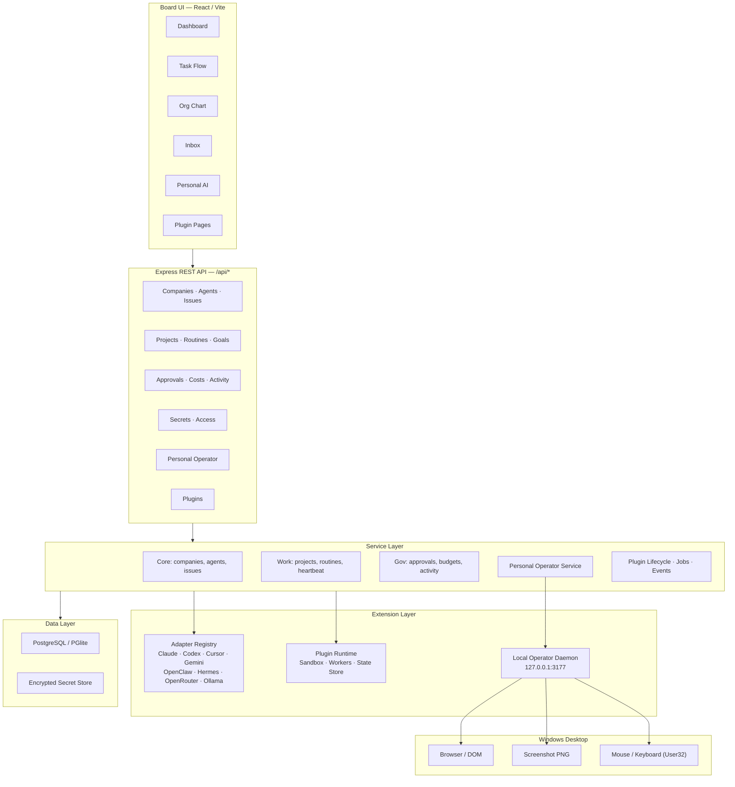
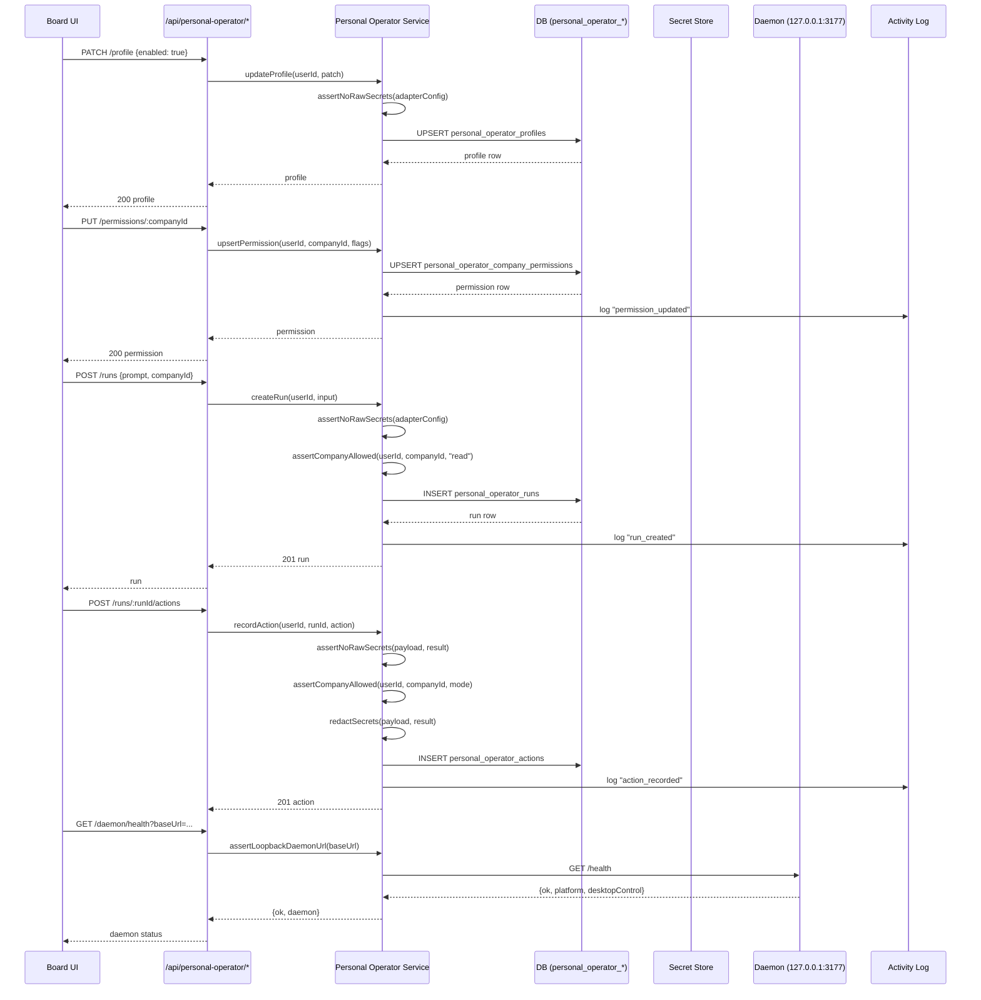
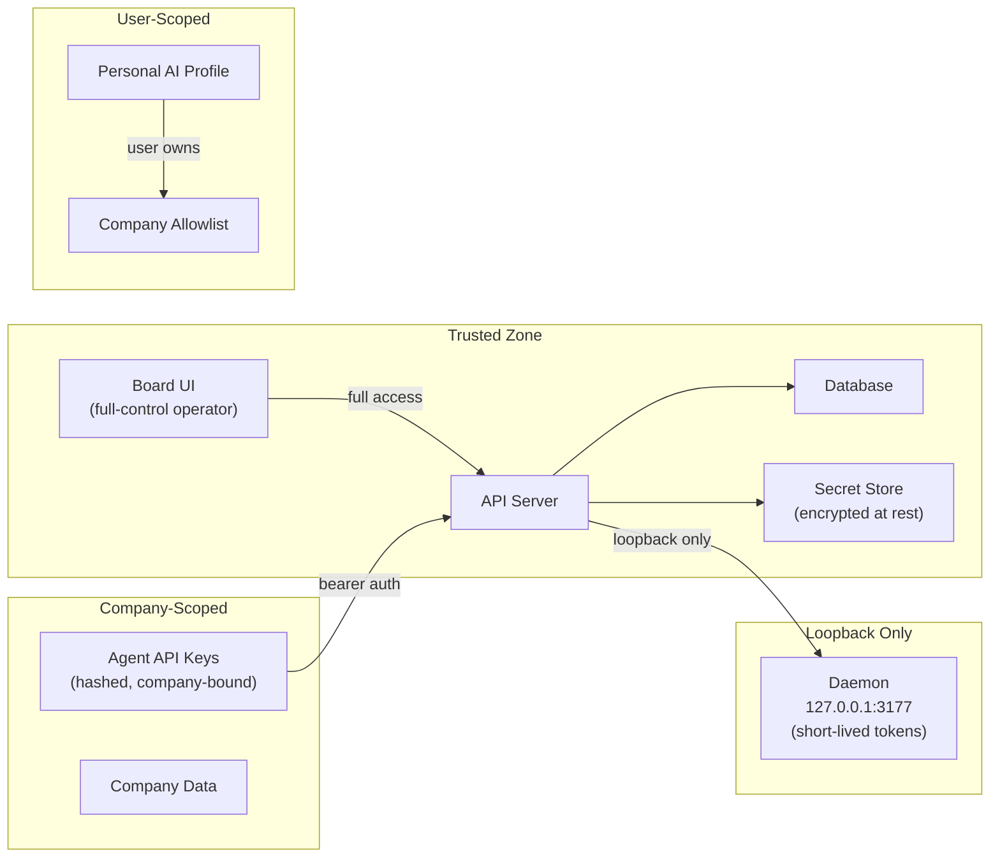
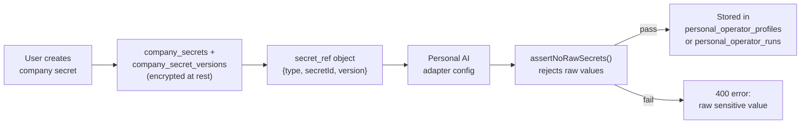

# Architecture

Paperclip has four synchronized layers plus extension layers for adapters, plugins, and local desktop control.

## System Overview



## Core Layers

### 1. `packages/shared` — Contract Layer

API contracts, validators (Zod schemas), constants, and shared TypeScript types. Every route and API client imports from this package to keep contracts synchronized.

### 2. `packages/db` — Data Layer

Drizzle ORM schema definitions, migration generation, and database client setup. Tables are organized by domain in `packages/db/src/schema/`. Supports embedded PGlite (dev) and external PostgreSQL (production).

### 3. `server` — API & Orchestration Layer

Express REST API mounted under `/api`. Contains route handlers, service logic, middleware (auth, validation, error handling), realtime event bus, and adapter orchestration.

### 4. `ui` — Board UI Layer

React/Vite single-page application. Uses React Query for server state, shared UI primitives, and company-scoped routing. Board surfaces include Task Flow, Org Chart, Inbox, Dashboard, and Personal AI.

## Extension Layers

### `packages/adapters` — Agent Runtime Adapters

Adapter implementations for connecting different AI agent runtimes. Each adapter implements a standard interface for starting, stopping, and communicating with agents.

### `packages/plugins` — Plugin System

Extensible plugin surfaces for custom integrations including jobs, webhooks, entity management, UI pages, and state storage. Plugins run in sandboxed workers.

### `packages/local-operator-daemon` — Desktop Control

Loopback HTTP daemon bound to `127.0.0.1:3177` for Windows desktop control. Exposes mouse movement, click, and screenshot capture via PowerShell/User32. Accepts bearer token authentication.

## Folder Structure

```
paperclip/
├── server/src/
│   ├── routes/              29 route modules
│   ├── services/            68 service modules
│   ├── middleware/           Auth, validation, error handling
│   ├── auth/                Board auth, agent JWT
│   ├── secrets/             Secret provider implementations
│   ├── realtime/            WebSocket event bus
│   └── __tests__/           98+ unit tests
├── ui/src/
│   ├── pages/               45 page components
│   ├── components/          Sidebar, UI primitives, design system
│   ├── api/                 25 API client modules
│   ├── lib/                 Hooks, query keys, router utilities
│   └── context/             React context providers
├── packages/
│   ├── db/src/schema/       60 schema definition files
│   ├── shared/src/          Types, validators, constants
│   ├── adapters/            Per-adapter packages
│   ├── adapter-utils/       Shared adapter utilities
│   ├── plugins/             Plugin system packages
│   └── local-operator-daemon/  Desktop control daemon
├── doc/                     Deep operational docs
├── cli/                     Paperclip CLI
└── tests/                   E2E and release smoke tests
```

## Personal AI Operator

### Data Flow



### Action Priority

Personal AI uses the least invasive control path that can complete the task:

1. **Paperclip API** — company work through existing endpoints.
2. **Browser DOM** — direct DOM manipulation.
3. **Browser accessibility / semantic tree** — accessible element interaction.
4. **Screenshot vision** — visual state capture and analysis.
5. **Desktop mouse/keyboard fallback** — Windows User32 via daemon.

## Trust Boundaries



Key invariants:
- Board access is full-control operator context.
- Agent API keys are hashed and company-scoped; they must not access other companies.
- Personal AI profile and allowlist state are user-scoped.
- Daemon URLs must be loopback addresses.
- Daemon tokens are short-lived (default 300s) and stored hashed server-side.
- API keys for reasoning providers must be company secrets referenced by `secret_ref`.

## Secret Flow



## Audit Logs

Personal AI records runs and actions in dedicated tables and logs company-scoped mutations into activity logs. Screenshot rows store metadata only by default and must not expose raw image paths or secret-bearing metadata.

All action payloads and results pass through `redactPersonalOperatorSecrets()` before persistence, stripping sensitive keys and replacing `secret_ref` details with `[redacted]`.
