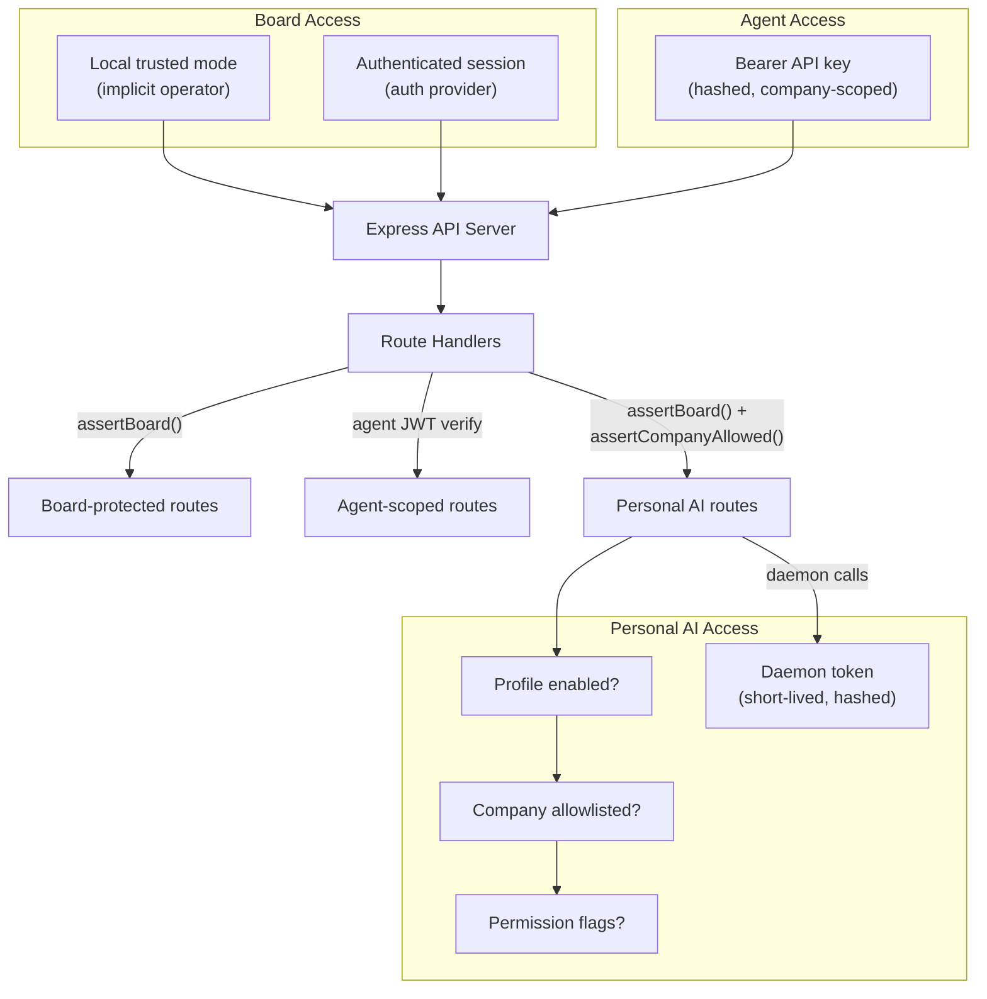
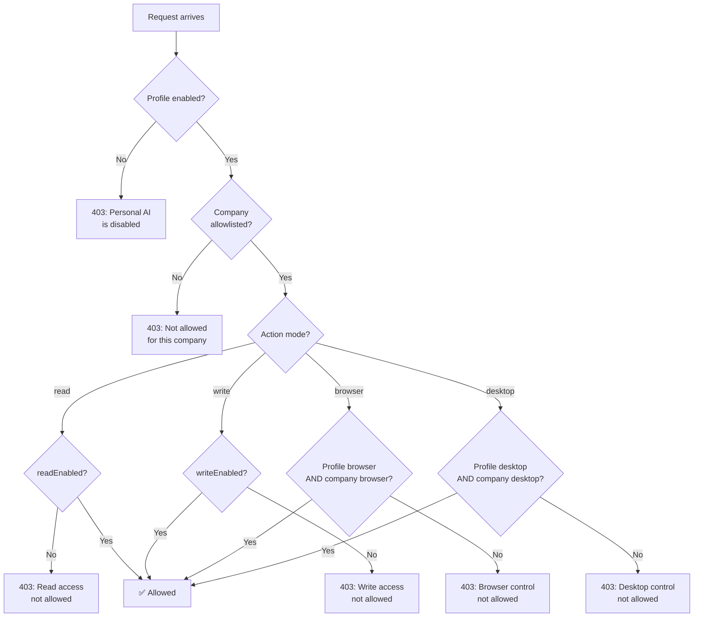
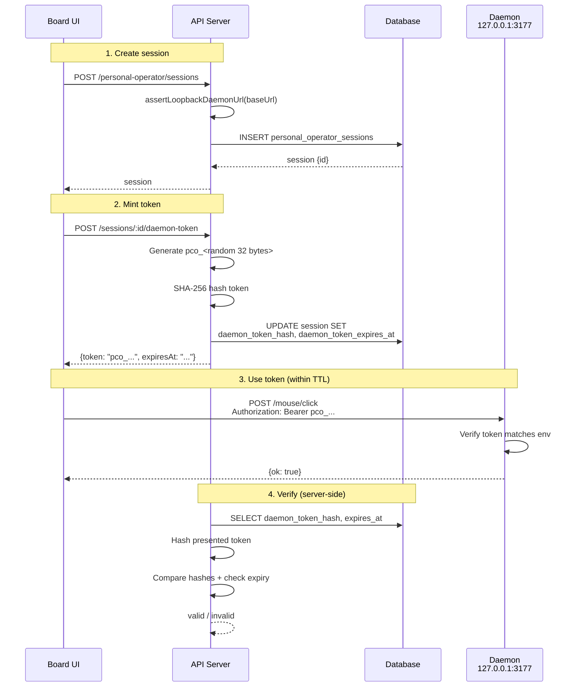
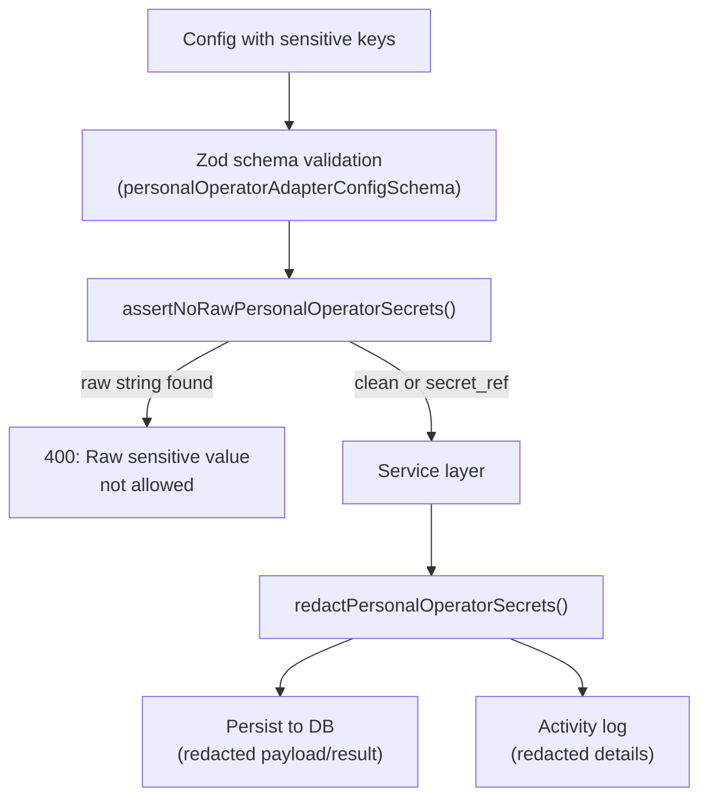

# Auth

Paperclip supports three authentication contexts: board operators, agent API keys, and Personal AI daemon tokens. Each context has distinct scoping, permissions, and secret handling rules.

## Auth Flow Overview



## Board Access

Board users operate the Paperclip control plane. In local trusted mode, the local board is treated as an implicit trusted operator. In authenticated mode, board sessions come from the configured auth provider and instance/company access checks apply.

- Protected by `assertBoard(req)` middleware.
- In local mode, `req.actor.userId` defaults to `"local-board"`.
- In authenticated mode, sessions provide `userId`, instance roles, and company memberships.

## Agent API Keys

Agents use bearer API keys issued per-company.

- Keys are **hashed at rest** (SHA-256) in `agent_api_keys`.
- Keys are **company-scoped** — an agent key must not access other companies.
- Auth header: `Authorization: Bearer <agent_api_key>`.
- The server verifies by hashing the presented key and matching against stored hashes.

## Personal AI Permissions

Personal AI is user-scoped and disabled by default. Access requires a multi-gate permission check:

### Permission Matrix



### Level Details

| Level | Scope | Flags | Enforcement |
|---|---|---|---|
| **Profile** | User-global | `enabled`, `daemonEnabled`, `browserControlEnabled`, `desktopControlEnabled`, `screenshotVisionEnabled` | Checked on every Personal AI operation |
| **Company** | Per-user, per-company | `readEnabled`, `writeEnabled`, `browserControlEnabled`, `desktopControlEnabled`, `approvalRequired` | Checked on company-scoped operations |

Key rules:
- Board access (`assertBoard`) is required for all Personal AI management routes.
- Company access (`assertCompanyAccess`) is required for company permission changes and company-scoped runs.
- Browser and desktop control require **both** profile-level **and** company-level enablement.
- Approval-required companies gate mutating actions through approval workflows.

## Daemon Auth

The local operator daemon binds to `127.0.0.1` by default. The server enforces loopback-only daemon URLs.

### Token Lifecycle



Key properties:
- Tokens are prefixed with `pco_` for identification.
- Default TTL is 300 seconds (5 minutes).
- Raw token is returned **only at issuance time** — it is never stored or logged.
- Token hash is stored in `personal_operator_sessions.daemon_token_hash`.
- Expired tokens are rejected; the client must request a new token.

## Secret Handling

User API keys must be created as company secrets and used through `secret_ref` objects. The system enforces this at multiple layers:

### Enforcement Points



### Sensitive Key Patterns

The following key patterns trigger raw value rejection:

| Pattern | Examples |
|---|---|
| `apiKey`, `apikey` | Direct key names |
| `*_API_KEY`, `*-api-key` | `OPENROUTER_API_KEY`, `hermes-api-key` |
| `token`, `*_token` | `access_token`, `auth_token` |
| `secret`, `*_secret` | `client_secret` |
| `password`, `passwd` | Password fields |
| `authorization` | Auth headers |
| `cookie` | Session cookies |

### Redaction Layers

Secret values are redacted from all external-facing surfaces:

| Surface | Redaction Method |
|---|---|
| Action payload/result (DB) | `redactPersonalOperatorSecrets()` before INSERT |
| Activity log details | Redacted payload/result passed to `logActivity()` |
| Run events | Adapter config validated, no raw keys stored |
| Websocket payloads | `redactEventPayload()` on realtime events |
| Screenshot metadata | `objectKey` stored as `[redacted]` |
| Company exports | Secret names only, no values or IDs |
| Log output | `redactCurrentUserText()` strips usernames/paths |
| GitHub-bound files | `check:tokens` script validates no forbidden tokens |

### Valid Secret Reference

```json
{
  "apiKey": {
    "type": "secret_ref",
    "secretId": "00000000-0000-4000-8000-000000000000",
    "version": "latest"
  }
}
```

### Invalid (Rejected)

```json
{
  "apiKey": "sk-abc123..."
}
```

This returns `400: Raw sensitive value is not allowed at apiKey; use a secret_ref.`
