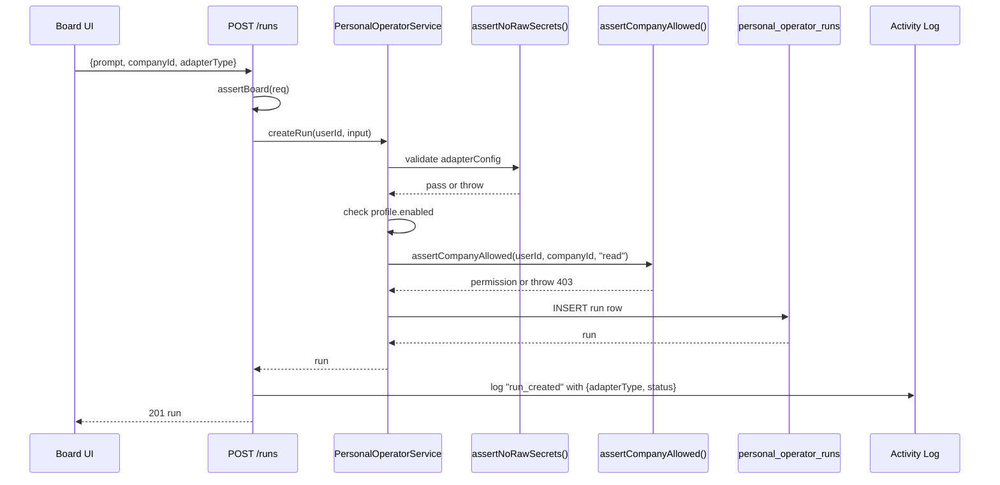
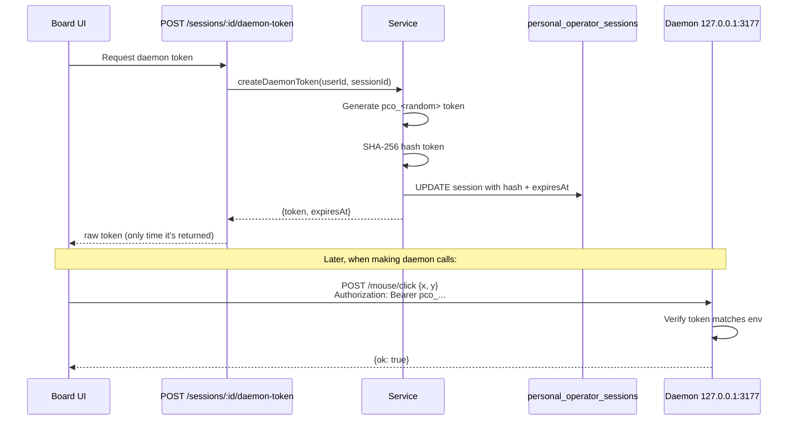
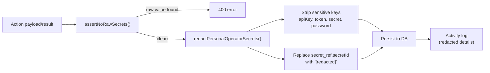

# Backend

The backend is an Express API in `server/`. Routes are mounted under `/api`, with shared validation from `@paperclipai/shared` and persistence through `@paperclipai/db`.

## Route Organization

```mermaid
flowchart TD
  API["/api"] --> Health["GET /health"]
  API --> Companies["/companies/*"]
  API --> Agents["/agents/*"]
  API --> Issues["/issues/*"]
  API --> Projects["/projects/*"]
  API --> Routines["/routines/*"]
  API --> Goals["/goals/*"]
  API --> Approvals["/approvals/*"]
  API --> Secrets["/secrets/*"]
  API --> Costs["/costs/*"]
  API --> Activity["/activity/*"]
  API --> Dashboard["/dashboard/*"]
  API --> Plugins["/plugins/*"]
  API --> Access["/access/*"]
  API --> PO["/personal-operator/*"]
  API --> SidebarBadges["/sidebar-badges/*"]
  API --> LLMs["/llms/*"]
  API --> InstanceSettings["/instance-settings/*"]
```

Route files live in `server/src/routes/`. Each file exports a function that creates an Express Router and receives the `Db` instance.

| Route File | Prefix | Purpose |
|---|---|---|
| `health.ts` | `/health` | Health check |
| `companies.ts` | `/companies` | Company CRUD, branding, export/import |
| `agents.ts` | `/agents` | Agent management, instructions, skills |
| `issues.ts` | `/issues` | Issue lifecycle, comments, attachments |
| `projects.ts` | `/projects` | Projects, workspaces, goals |
| `routines.ts` | `/routines` | Scheduled routines and triggers |
| `goals.ts` | `/goals` | Company and project goals |
| `approvals.ts` | `/approvals` | Approval gates and comments |
| `secrets.ts` | `/secrets` | Company secrets management |
| `costs.ts` | `/costs` | Cost events and spend tracking |
| `activity.ts` | `/activity` | Activity log queries |
| `plugins.ts` | `/plugins` | Plugin lifecycle, config, jobs |
| `access.ts` | `/access` | Memberships, invites, permissions |
| `personal-operator.ts` | `/personal-operator` | Personal AI profiles, runs, actions |
| `instance-settings.ts` | `/instance-settings` | Global instance configuration |

## Service Layer

Business logic lives in `server/src/services/`. Key services include:

| Service | Purpose |
|---|---|
| `companies.ts` | Company CRUD, org hierarchy |
| `agents.ts` | Agent lifecycle, config revisions |
| `issues.ts` | Issue assignment, status transitions, checkout |
| `heartbeat.ts` | Agent heartbeat monitoring and run tracking |
| `approvals.ts` | Approval creation, voting, resolution |
| `budgets.ts` | Budget policies, spend tracking, auto-pause |
| `routines.ts` | Routine scheduling, trigger evaluation, run execution |
| `secrets.ts` | Secret creation, versioning, encryption |
| `personal-operator.ts` | Personal AI profile, permissions, sessions, runs, actions |
| `company-portability.ts` | Company export/import with secret handling |
| `plugin-lifecycle.ts` | Plugin installation, activation, worker management |

## Personal Operator Service

`server/src/services/personal-operator.ts` owns:

- User profile defaults and updates (upsert pattern).
- Per-company allowlist permissions (upsert with compound unique key).
- Session creation with loopback URL validation.
- Short-lived daemon token issuance (SHA-256 hashed) and verification.
- Run creation with profile enablement and company permission checks.
- Action recording with redacted payload/result data.
- Screenshot metadata recording (objectKey always redacted).

### Run Lifecycle

The service rejects raw sensitive config values through shared validators and `assertNoRawPersonalOperatorSecrets`.

## Adapter Routing

Personal AI reasoning is represented by adapter type and adapter config:

| Adapter Type | Label | Use Case |
|---|---|---|
| `hermes_local` | Hermes | Local Hermes inference |
| `openclaw_gateway` | OpenClaw | OpenClaw gateway API |
| `openrouter` | OpenRouter | OpenRouter hosted models |
| `ollama` | Ollama | Local Ollama instance |

Adapter credentials must be secret refs. Raw `apiKey`, `token`, `secret`, or `password` values are rejected before persistence.

## Daemon Bridge

`packages/local-operator-daemon` exposes a local HTTP daemon bound to `127.0.0.1` by default. The server only accepts loopback daemon URLs and mints short-lived bearer tokens for daemon sessions.

### Daemon Endpoints

| Method | Path | Auth | Description |
|---|---|---|---|
| `GET` | `/health` | None | Daemon health, platform, capabilities |
| `POST` | `/mouse/move` | Bearer | Move cursor to `{x, y}` |
| `POST` | `/mouse/click` | Bearer | Click at `{x, y}` |
| `POST` | `/screenshot` | Bearer | Capture screen as base64 PNG |

### Daemon Auth Flow

Windows desktop actions use User32 through PowerShell. Non-Windows platforms report unsupported desktop control.

## Middleware

### Authentication

- `assertBoard(req)` — verifies the request comes from a board operator (local trusted or authenticated session).
- `assertCompanyAccess(req, companyId)` — verifies the actor has access to the specified company.
- Agent bearer auth uses `agent_api_keys` with SHA-256 hashed keys.

### Validation

The `validate(schema)` middleware applies Zod schema validation to `req.body` before the route handler runs. Validation failures return 400 with structured error details.

### Error Handling

Standard HTTP error responses: `400` (bad request), `401` (unauthorized), `403` (forbidden), `404` (not found), `409` (conflict), `422` (unprocessable), `500` (server error).

## Secret Redaction Pipeline

All action payloads and results are redacted **before** database persistence and activity logging.

## Activity

Company-scoped Personal AI permission changes, run creation, and action recording emit activity log entries with redacted details. Activity entries include:

| Action | Entity Type | Details |
|---|---|---|
| `personal_operator.permission_updated` | `personal_operator_permission` | Permission flags |
| `personal_operator.run_created` | `personal_operator_run` | Adapter type, status |
| `personal_operator.action_recorded` | `personal_operator_action` | Kind, method, status, approval flag |
