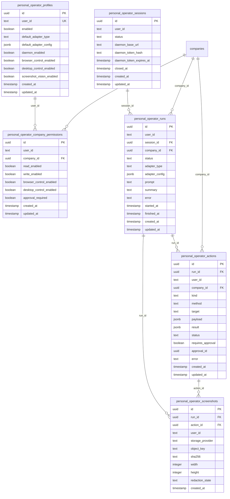

# Database

Paperclip uses Drizzle schema definitions in `packages/db/src/schema`. The deeper operational reference is [doc/DATABASE.md](doc/DATABASE.md) covering embedded, Docker, and hosted PostgreSQL setup.

## Development Database

Leave `DATABASE_URL` unset in dev to use the embedded database.

```sh
pnpm dev
```

To reset local dev data:

```sh
rm -rf data/pglite
pnpm dev
```

## Migration Workflow

When changing schema:

1. Edit `packages/db/src/schema/*.ts`
2. Ensure new tables are exported from `packages/db/src/schema/index.ts`
3. Generate migration:

```sh
pnpm db:generate
```

4. Validate compile:

```sh
pnpm -r typecheck
```

Notes:
- `packages/db/drizzle.config.ts` reads compiled schema from `dist/schema/*.js`.
- `pnpm db:generate` compiles `packages/db` first.

## Schema Overview

The database has 60+ schema files organized by domain. Key table groups include:

| Domain | Tables | Purpose |
|---|---|---|
| Companies | `companies`, `company_logos`, `company_memberships` | Company identity and membership |
| Agents | `agents`, `agent_api_keys`, `agent_config_revisions`, `agent_runtime_state` | Agent lifecycle and runtime |
| Issues | `issues`, `issue_comments`, `issue_labels`, `issue_attachments`, `issue_work_products` | Work tracking |
| Projects | `projects`, `project_workspaces`, `execution_workspaces` | Workspace management |
| Routines | `routines`, `routine_triggers`, `routine_runs` | Scheduled automation |
| Approvals | `approvals`, `approval_comments`, `issue_approvals` | Governance gates |
| Costs | `cost_events`, `finance_events`, `budget_policies`, `budget_incidents` | Cost tracking |
| Secrets | `company_secrets`, `company_secret_versions` | Encrypted credential storage |
| Plugins | `plugins`, `plugin_config`, `plugin_state`, `plugin_jobs`, `plugin_logs` | Plugin system |
| Auth | `auth_users`, `auth_sessions`, `auth_accounts` | Authentication |
| Personal AI | `personal_operator_*` (6 tables) | Personal AI Operator |
| Activity | `activity_log` | Audit trail |

## Personal AI Tables



### Table Details

| Table | Unique Constraints | Indexes | Relationships |
|---|---|---|---|
| `personal_operator_profiles` | `(user_id)` | — | One per user |
| `personal_operator_company_permissions` | `(user_id, company_id)` | `(company_id)` | FK → `companies.id` (cascade delete) |
| `personal_operator_sessions` | — | `(user_id, status)` | — |
| `personal_operator_runs` | — | `(user_id, created_at)`, `(company_id, created_at)` | FK → `sessions.id` (set null), FK → `companies.id` (set null) |
| `personal_operator_actions` | — | `(run_id, created_at)`, `(company_id, created_at)` | FK → `runs.id` (cascade), FK → `companies.id` (set null) |
| `personal_operator_screenshots` | — | `(run_id, created_at)` | FK → `runs.id` (cascade), FK → `actions.id` (set null) |

### Default Values

| Column | Default |
|---|---|
| `profiles.enabled` | `false` |
| `profiles.default_adapter_type` | `"openrouter"` |
| `profiles.daemon_enabled` | `false` |
| `profiles.browser_control_enabled` | `false` |
| `profiles.desktop_control_enabled` | `false` |
| `profiles.screenshot_vision_enabled` | `true` |
| `permissions.read_enabled` | `false` |
| `permissions.write_enabled` | `false` |
| `permissions.approval_required` | `true` |
| `sessions.daemon_base_url` | `"http://127.0.0.1:3177"` |
| `runs.status` | `"queued"` |
| `actions.status` | `"queued"` |
| `actions.requires_approval` | `true` |
| `screenshots.storage_provider` | `"metadata_only"` |
| `screenshots.redaction_state` | `"metadata_only"` |

## Secret Invariants

- Raw provider keys are not stored in Personal AI profile or run config.
- Sensitive config must reference `company_secrets` via `secret_ref` objects.
- Secret material remains in `company_secret_versions` (encrypted at rest) and is not exported to GitHub-bound files.
- Exports include required secret names, not secret values or raw secret IDs unless an explicit import binding requires an internal reference.
- The `object_key` column in `personal_operator_screenshots` is always stored as `[redacted]` to prevent path exposure.
- All `payload` and `result` JSONB columns in `personal_operator_actions` pass through `redactPersonalOperatorSecrets()` before persistence.
