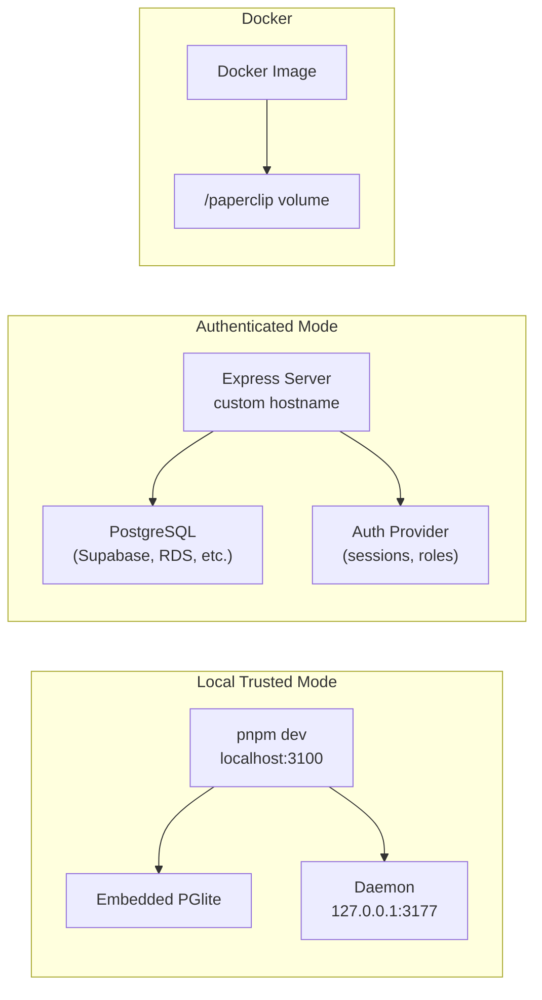

# Deployment

Paperclip supports local trusted development and authenticated deployments. The Personal AI Operator adds a local daemon component for desktop control.

## Deployment Modes



## Local Trusted Mode

The default local setup treats the board as a trusted operator context. No authentication is required.

```sh
pnpm install
pnpm dev
```

API and UI run at `http://localhost:3100`.

Quick checks:

```sh
curl http://localhost:3100/api/health
curl http://localhost:3100/api/companies
```

## Authenticated Mode

Authenticated deployments use board sessions, instance roles, company memberships, and scoped agent API keys. Public deployments must configure hostnames, auth base URL, and secret storage carefully.

## Embedded Database

For dev, leave `DATABASE_URL` unset. The server automatically starts an embedded PostgreSQL instance. See [doc/DATABASE.md](doc/DATABASE.md) for Docker and hosted PostgreSQL setup.

Production-like deployments should provide a managed Postgres-compatible database via `DATABASE_URL`.

## Docker Deployment

A `Dockerfile` is included for containerized deployments:

```sh
docker build -t paperclip .
docker run -p 3100:3100 -v paperclip_data:/paperclip paperclip
```

Persist the `/paperclip` volume to keep database state across container restarts. See `docker/` for Docker Compose examples.

## Environment Variables

| Variable | Default | Description |
|---|---|---|
| `DATABASE_URL` | (unset = embedded) | PostgreSQL connection string |
| `PORT` | `3100` | Server port |
| `HOST` | `0.0.0.0` | Server bind address |
| `PAPERCLIP_SECRETS_MASTER_KEY` | (auto-generated) | Secret encryption master key (base64) |
| `PAPERCLIP_SECRETS_MASTER_KEY_FILE` | `~/.paperclip/.../master.key` | Path to master key file |
| `PAPERCLIP_SECRETS_STRICT_MODE` | `false` | Block new inline sensitive env values |
| `PAPERCLIP_OPERATOR_DAEMON_HOST` | `127.0.0.1` | Daemon bind address |
| `PAPERCLIP_OPERATOR_DAEMON_PORT` | `3177` | Daemon port |
| `PAPERCLIP_OPERATOR_DAEMON_TOKEN` | (empty) | Static daemon bearer token |

## Personal AI Daemon

The local operator daemon is in `packages/local-operator-daemon`.

### Startup

```sh
pnpm --filter @paperclipai/local-operator-daemon dev
```

Or configure it to start alongside the main server.

### Configuration

| Setting | Default | Description |
|---|---|---|
| Host | `127.0.0.1` | Loopback-only binding |
| Port | `3177` | Daemon HTTP port |
| Health | `http://127.0.0.1:3177/health` | Health check URL |
| Token | (empty) | Bearer token for auth (set via env) |

### Health Check

```sh
curl http://127.0.0.1:3177/health
```

Response:
```json
{
  "ok": true,
  "host": "127.0.0.1",
  "port": 3177,
  "platform": "win32",
  "desktopControl": "windows-user32",
  "screenshotVision": "screenshot_png",
  "auth": "bearer"
}
```

### Windows Desktop Requirements

Desktop control (mouse/keyboard/screenshot) requires:

- **Windows OS** — `process.platform === "win32"`
- **Interactive desktop session** — the user must be logged in with an active desktop
- **PowerShell** — for executing User32 calls via `System.Windows.Forms` and `System.Drawing`
- **No elevated privileges required** — runs under the user's normal session

Non-Windows platforms return:
```json
{
  "desktopControl": "unsupported"
}
```

### Daemon Endpoints

| Method | Path | Auth Required | Description |
|---|---|---|---|
| `GET` | `/health` | No | Health check and capabilities |
| `POST` | `/mouse/move` | Yes | Move cursor to `{x, y}` coordinates |
| `POST` | `/mouse/click` | Yes | Click at `{x, y}` coordinates |
| `POST` | `/screenshot` | Yes | Capture full screen as base64 PNG |

## Security Requirements

- Keep daemon URLs loopback-only — the server rejects non-loopback daemon URLs.
- Use short-lived daemon tokens (default 300s TTL) for control endpoints.
- Keep Personal AI disabled until a user explicitly enables it.
- Do not deploy raw API keys through config files or committed artifacts.
- Store all provider credentials as company secrets with `secret_ref` references.

## Troubleshooting

| Issue | Solution |
|---|---|
| Daemon health check fails | Verify the daemon is running and the port is not blocked. Check `http://127.0.0.1:3177/health` directly. |
| "Desktop control unsupported" | The daemon is running on a non-Windows platform. Desktop control requires Windows. |
| Screenshot capture fails | Ensure the user has an active desktop session. Remote/headless sessions may not support screen capture. |
| "Personal AI is disabled" | Enable the profile via `PATCH /api/personal-operator/profile` with `{enabled: true}`. |
| "Not allowed for this company" | Add company permissions via `PUT /api/personal-operator/permissions/:companyId` with `{readEnabled: true}`. |
| Embedded DB corrupt | Delete `data/pglite` and restart with `pnpm dev` to recreate. |
| Raw API key rejected | Create a company secret and use `{"type": "secret_ref", "secretId": "...", "version": "latest"}` instead. |
