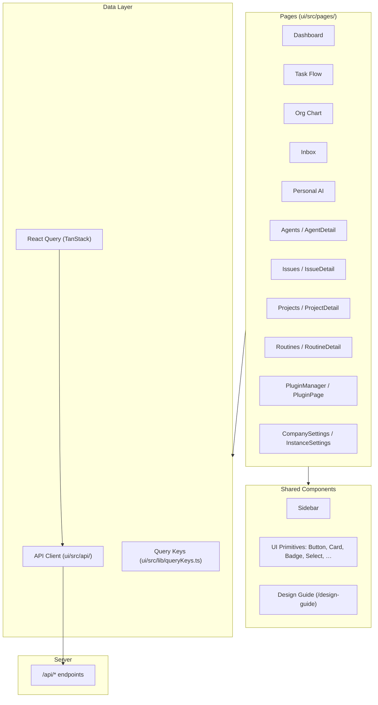
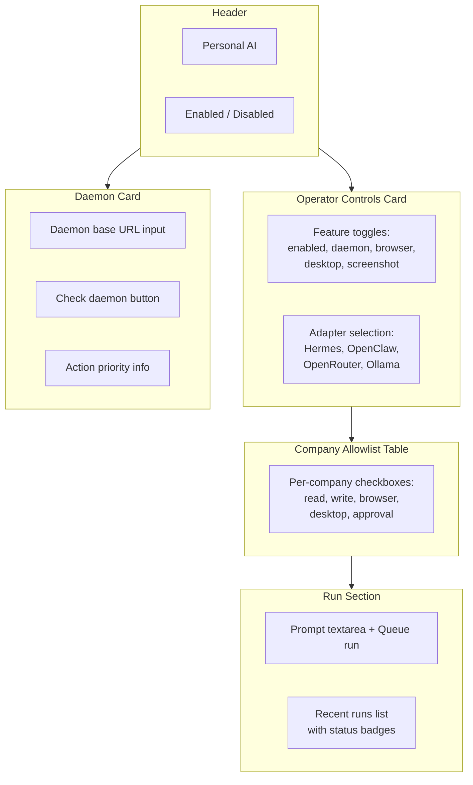

# Frontend

The frontend is a React/Vite app in `ui/`. It uses React Query for server state, local route helpers in `ui/src/lib/router`, and shared UI primitives in `ui/src/components/ui`.

## Architecture



## Folder Structure

```
ui/src/
├── App.tsx              Main router and route declarations
├── main.tsx             Entry point, providers, React Query client
├── index.css            Design system tokens and global styles
├── pages/               45 page components
│   ├── Dashboard.tsx
│   ├── TaskFlow.tsx
│   ├── OrgChart.tsx
│   ├── Inbox.tsx
│   ├── PersonalAI.tsx
│   ├── Agents.tsx / AgentDetail.tsx
│   ├── Issues.tsx / IssueDetail.tsx
│   ├── Projects.tsx / ProjectDetail.tsx
│   ├── Routines.tsx / RoutineDetail.tsx
│   ├── PluginManager.tsx / PluginPage.tsx
│   ├── CompanySettings.tsx
│   ├── InstanceSettings.tsx
│   └── DesignGuide.tsx
├── components/          Shared components
│   ├── Sidebar.tsx      Primary board navigation
│   └── ui/              Design system primitives
├── api/                 25 API client modules
│   ├── client.ts        Base fetch wrapper
│   ├── personalOperator.ts
│   ├── companies.ts
│   ├── agents.ts
│   └── …
├── lib/                 Utilities
│   ├── queryKeys.ts     React Query key factory
│   └── router/          Route helpers
├── context/             React context providers
├── hooks/               Custom React hooks
└── plugins/             Plugin UI integration
```

## Routes

Company-prefixed board routes are declared in `ui/src/App.tsx`. Key routes include:

| Path | Page | Description |
|---|---|---|
| `/:companyPrefix/dashboard` | Dashboard | Company overview and metrics |
| `/:companyPrefix/task-flow` | TaskFlow | Visual task dependency graph |
| `/:companyPrefix/org` | OrgChart | Agent org chart visualization |
| `/:companyPrefix/inbox` | Inbox | Issue inbox with filters |
| `/:companyPrefix/agents` | Agents | Agent list and management |
| `/:companyPrefix/issues` | Issues | Issue list |
| `/:companyPrefix/projects` | Projects | Project list |
| `/:companyPrefix/routines` | Routines | Scheduled routines |
| `/:companyPrefix/approvals` | Approvals | Approval queue |
| `/:companyPrefix/costs` | Costs | Cost tracking and budgets |
| `/:companyPrefix/activity` | Activity | Activity log |
| `/:companyPrefix/plugins` | PluginManager | Plugin management |
| `/personal-ai` | PersonalAI | Personal AI Operator |
| `/design-guide` | DesignGuide | Design system showcase |
| `/settings` | InstanceSettings | Instance configuration |

The Personal AI page is available at:
- `/:companyPrefix/personal-ai` — company-prefixed path
- `/personal-ai` — redirects into the selected company prefix

## Sidebar

`ui/src/components/Sidebar.tsx` contains the primary board navigation. The sidebar is organized into sections:

```
┌─────────────────────────┐
│  Dashboard              │
│  Inbox                  │
│  Personal AI  [New]     │
├─────────────────────────┤
│  Task Flow              │
│  Org Chart              │
│  Agents                 │
│  Issues                 │
│  Projects               │
│  Goals                  │
│  Routines               │
├─────────────────────────┤
│  Approvals              │
│  Costs                  │
│  Activity               │
├─────────────────────────┤
│  Plugins                │
│  Skills                 │
│  Company Settings       │
└─────────────────────────┘
```

Personal AI is shown near Dashboard and Inbox so it is user-owned rather than nested under one company function.

## Personal AI Page

`ui/src/pages/PersonalAI.tsx` provides a comprehensive operator control surface:



Key behaviors:
- **Feature toggles** update the profile via `PATCH /personal-operator/profile`.
- **Adapter selection** saves the default reasoning adapter.
- **Daemon health** pings the loopback URL through the server proxy.
- **Company allowlist** shows all companies with per-flag checkboxes.
- **Run creation** is disabled until the profile is enabled.
- API key entry is deliberately excluded — users create company secrets and reference them with `secret_ref`.

## State and API

`ui/src/api/personalOperator.ts` wraps `/api/personal-operator/*` routes. Query keys live under `queryKeys.personalOperator`:

| Query Key | API Call | Lifecycle |
|---|---|---|
| `personalOperator.profile` | `GET /personal-operator/profile` | Invalidated on profile update |
| `personalOperator.permissions` | `GET /personal-operator/permissions` | Invalidated on permission update |
| `personalOperator.runs` | `GET /personal-operator/runs` | Invalidated on run creation |

Mutations use `useMutation` with `onSuccess` invalidation to keep the UI in sync.

## Design Expectations

- Keep operational pages dense and scannable.
- Use icons for tool-like actions and concise labels for commands.
- Use the design system primitives from `ui/src/components/ui/` (Button, Card, Badge, Select, Checkbox, Input, Textarea, Label).
- Do not expose raw API-key entry in Personal AI adapter config. Users should create company secrets and reference them with `secret_ref`.
- Surface API validation failures clearly instead of silently ignoring them.
- For graph surfaces (Task Flow, Org Chart), prefer resilient rendering over blank canvases — keep rendering even when relationships are partial, detached, or cyclic.
- The design guide at `/design-guide` documents all available UI primitives and patterns.
