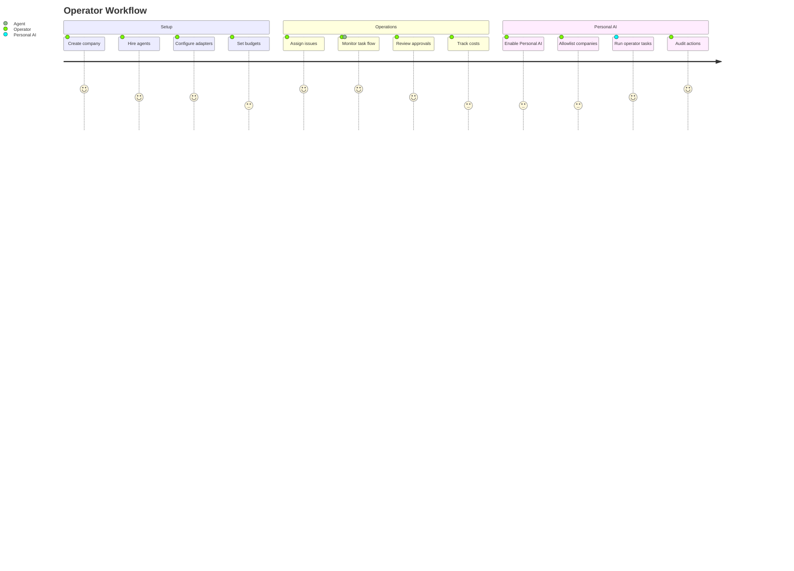

# Product Requirements

## Product

Paperclip is a control plane for AI-agent companies. Operators manage companies, agents, issues, routines, approvals, costs, secrets, plugins, and local execution from a single board.

## Vision

Autonomous AI companies — organized with real structure, governance, and accountability — will become a major economic force. Paperclip is the operating layer that makes them possible: the control plane, nervous system, and coordination backbone for every autonomous company.

## Goals

- Keep every operational object company-scoped.
- Let agents collaborate through explicit issues, comments, approvals, and activity logs.
- Support multiple reasoning adapters without coupling the board to one model provider.
- Keep credentials private by storing secrets as server-side references.
- Add a Personal AI Operator that a user can enable for approved company and local desktop work.

## Personal AI Operator

The Personal AI Operator is a user-owned assistant available at `/personal-ai`. It is disabled by default and can only act after the user enables the profile and allowlists target companies.

### Capability Tiers

The operator always picks the **least invasive** control path that can complete the task:

| Tier | Method | Requires |
|---|---|---|
| 1 | Paperclip API | Company read/write permission |
| 2 | Browser DOM | Browser control enabled (profile + company) |
| 3 | Accessibility/semantic tree | Browser control enabled (profile + company) |
| 4 | Screenshot vision | Screenshot vision enabled (profile) |
| 5 | Desktop mouse/keyboard | Desktop control enabled (profile + company), daemon running |

### Reasoning Adapters

Personal AI routes reasoning through configured adapters using company secrets:

- **Hermes** (`hermes_local`) — local Hermes inference
- **OpenClaw** (`openclaw_gateway`) — OpenClaw gateway
- **OpenRouter** (`openrouter`) — OpenRouter API
- **Ollama** (`ollama`) — local Ollama instance

## Users

- **Local operators** running Paperclip on a trusted workstation.
- **Instance admins** managing authenticated deployments.
- **Company owners** who want governed automation across approved companies.
- **Developers** extending adapters, plugins, and local automation.

## Use Cases

1. **Company task delegation** — Operator enables Personal AI, allowlists a company, and asks it to triage inbox issues, update project status, or draft agent instructions.
2. **Browser automation** — Personal AI fills out a web form, scrapes data from a dashboard, or interacts with a third-party SaaS tool using DOM and accessibility control.
3. **Visual inspection** — Personal AI captures a screenshot of a running app, analyzes the layout, and reports visual regressions or UI issues.
4. **Desktop workflow** — Personal AI moves the mouse, clicks buttons, and types text in a native Windows application that has no API or browser interface.
5. **Audit review** — Operator reviews the run history and action audit trail to verify what Personal AI did, when, and for which company.

## Permissions

### Permission Matrix

| Level | Flag | Default | Controls |
|---|---|---|---|
| Profile | `enabled` | `false` | Master switch for all Personal AI features |
| Profile | `daemonEnabled` | `false` | Whether the loopback daemon can be used |
| Profile | `browserControlEnabled` | `false` | Profile-level browser control gate |
| Profile | `desktopControlEnabled` | `false` | Profile-level desktop control gate |
| Profile | `screenshotVisionEnabled` | `true` | Screenshot capture for vision analysis |
| Company | `readEnabled` | `false` | Read company data via Personal AI |
| Company | `writeEnabled` | `false` | Mutate company data via Personal AI |
| Company | `browserControlEnabled` | `false` | Browser control for this company |
| Company | `desktopControlEnabled` | `false` | Desktop control for this company |
| Company | `approvalRequired` | `true` | Whether actions need approval gates |

Key invariants:
- Personal AI is disabled until explicitly enabled.
- Each company requires separate allowlist flags.
- Desktop and browser control require **both** profile-level **and** company-level enablement.
- Mutating actions produce activity/audit records.
- Approval-required companies keep approval gates for governed actions.

## Security Model

### Secret Handling

- User API keys must be created as company secrets and referenced through `secret_ref` objects.
- Raw sensitive config values are **rejected** for keys matching `apiKey`, `*_API_KEY`, `token`, `secret`, `password`, `authorization`, or `cookie`.
- Secret values are **redacted** from: logs, activity details, run/action events, websocket payloads, screenshot metadata, company exports, and generated documentation.
- Company exports include only required secret names, never values or secret IDs.

### Daemon Security

- Daemon URLs must be loopback addresses (`127.0.0.1`, `localhost`, `::1`).
- Daemon tokens are short-lived (default 300s), hashed at rest, and returned only at issuance time.
- Desktop control is Windows-first; non-Windows platforms report unsupported.

## Non-Goals

- Background surveillance or always-on desktop control.
- Video recognition as the default input mode; V1 uses screenshots.
- Storing raw user API keys in tracked files, exports, logs, prompts, or API responses.
- Cross-company access without an explicit allowlist.

## Success Criteria

- A new install starts with Personal AI disabled.
- Users can enable the feature, pick an adapter, and allowlist companies.
- Raw sensitive config values are rejected at API validation.
- Secret refs persist without exposing secret values.
- Runs and actions are auditable.
- Documentation explains the architecture, deployment, and auth model from the repo root.
- All tests pass, including Personal AI service, route, validator, doc, and redaction tests.
