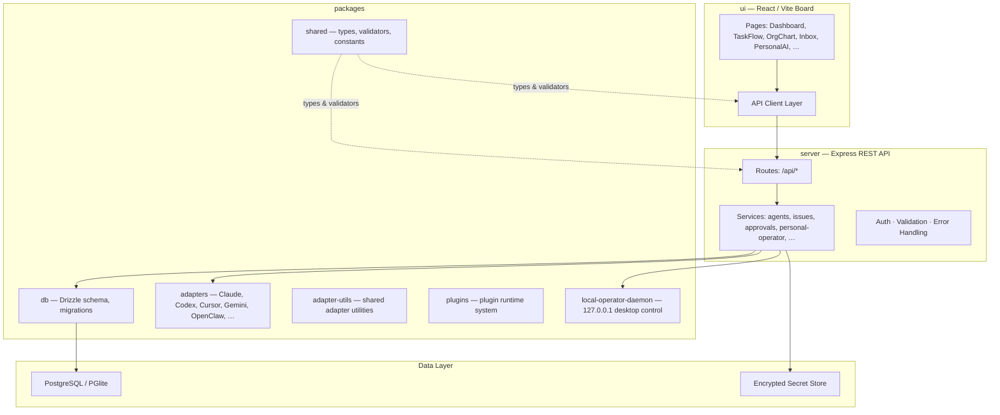

# Paperclip

Paperclip is a local-first control plane for AI-agent companies. It coordinates companies, agents, issues, approvals, costs, secrets, plugins, and adapter-backed agent runs from one board UI.

## Architecture at a Glance



## Folder Structure

```
paperclip/
├── server/              Express REST API and orchestration services
│   └── src/
│       ├── routes/      API route handlers
│       ├── services/    Business logic layer
│       ├── middleware/   Auth, validation, error handling
│       └── __tests__/   Server unit tests
├── ui/                  React + Vite board UI
│   └── src/
│       ├── pages/       Page components (Dashboard, PersonalAI, …)
│       ├── components/  Shared UI components and design system
│       ├── api/         API client wrappers
│       └── lib/         Hooks, query keys, utilities
├── packages/
│   ├── db/              Drizzle schema, migrations, DB clients
│   ├── shared/          Shared types, constants, validators
│   ├── adapters/        Agent adapter implementations
│   ├── adapter-utils/   Shared adapter utilities
│   ├── plugins/         Plugin system packages
│   └── local-operator-daemon/  Loopback daemon for desktop control
├── doc/                 Operational and product documentation
├── cli/                 Paperclip CLI
├── tests/               E2E and smoke tests
└── scripts/             Build, release, and dev scripts
```

## Quickstart

```sh
pnpm install
pnpm dev
```

Dev starts the API and UI at `http://localhost:3100`. Leave `DATABASE_URL` unset to use the embedded PGlite/Postgres dev database.

Useful checks:

```sh
curl http://localhost:3100/api/health
curl http://localhost:3100/api/companies
```

## Main Features

- **Company-scoped agent orgs** — task flow, goals, projects, routines, approvals, and activity, all scoped to individual companies.
- **Adapter registry** — local and hosted reasoning backends including Codex, Claude, Cursor, Gemini, OpenClaw, Hermes, OpenRouter, and Ollama.
- **Secret storage** — encrypted at rest with secret references for runtime credentials; raw keys are never committed.
- **Plugin system** — extensible plugin surfaces for custom integrations, jobs, webhooks, and entity management.
- **Org chart and task flow** — visual graph surfaces that render even when relationships are partial or cyclic.
- **Budget and cost tracking** — per-agent token budgets, spend tracking, and auto-pause on budget overrun.
- **Personal AI Operator** — user-owned assistant at `/personal-ai` for approved company work, browser automation, screenshot vision, and Windows desktop control through a loopback daemon. Disabled by default.

## Personal AI Operator

The Personal AI Operator lets a local board user delegate company work and desktop tasks to a reasoning adapter. It is **disabled by default** and requires explicit enablement plus per-company allowlisting.

Capabilities (in priority order):
1. Paperclip API — company work through existing endpoints
2. Browser DOM — direct DOM manipulation
3. Browser accessibility tree — semantic element interaction
4. Screenshot vision — visual state capture and analysis
5. Desktop mouse/keyboard — Windows desktop fallback via loopback daemon

All adapter credentials must use `secret_ref` objects. Raw API keys are rejected at validation.

## Documentation

| Doc | Contents |
|---|---|
| [PRD.md](PRD.md) | Product requirements, use cases, permissions, and scope |
| [ARCHITECTURE.md](ARCHITECTURE.md) | System architecture, data flow, trust boundaries |
| [BACKEND.md](BACKEND.md) | Server services, routes, orchestration, and redaction |
| [FRONTEND.md](FRONTEND.md) | UI routes, layout, state patterns, and design system |
| [API.md](API.md) | REST API overview with endpoint tables and examples |
| [DATABASE.md](DATABASE.md) | Schema, migrations, ER diagrams, secret invariants |
| [DEPLOYMENT.md](DEPLOYMENT.md) | Local, authenticated, and Docker deployment notes |
| [AUTH.md](AUTH.md) | Board, agent, daemon, and secret auth rules |

Deeper implementation references remain under `doc/`, especially `doc/SPEC-implementation.md`, `doc/DEVELOPING.md`, and `doc/DATABASE.md`.

## Verification

Before handing off behavior changes, run:

```sh
pnpm -r typecheck
pnpm test:run
pnpm build
```

## Secret Safety

Never commit user API keys or raw tokens. Adapter credentials must be stored as company secrets and referenced through `secret_ref` objects. Personal AI rejects raw values under sensitive keys such as `apiKey`, `*_API_KEY`, `token`, `secret`, and `password`. Secrets are redacted from logs, activity details, run events, websocket payloads, screenshots, exports, and documentation generated by the app.
